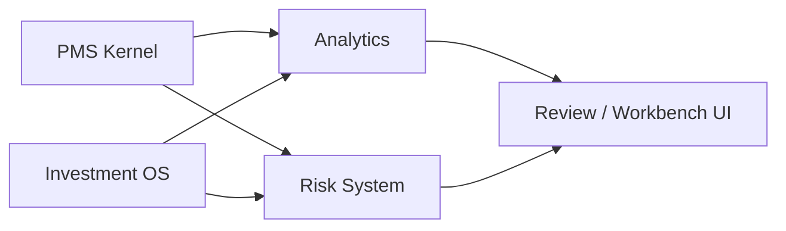
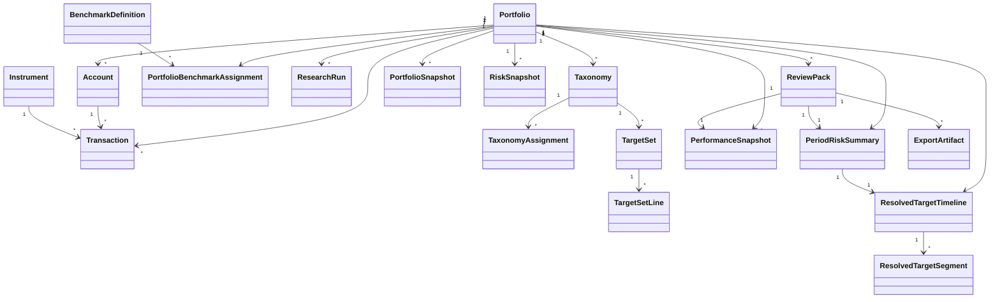

# PMS 正式版领域模型

更新时间：`2026-04-14`
关联文档：

- [`01_PMS_REFERENCE_BASELINE.md`](./01_PMS_REFERENCE_BASELINE.md)
- [`02_PRODUCT_PRD.md`](./02_PRODUCT_PRD.md)

## 1. 文档目标

这份文档用于锁定正式版 PMS 的核心领域对象、边界、关系和不变量。

目标不是定义数据库表，而是先定义业务世界中的对象语义，确保后续：

- 计算口径一致；
- 风控对象不是临时拼出来的；
- 研究、组合运行、风险预算、复盘之间的边界清晰；
- 前端页面和 API 都建立在同一套对象模型上。

## 2. 设计原则

### 2.1 事实、配置、分析结果分层

领域对象分三层：

1. **事实层**
   transactions、quotes、FX、benchmark series、corporate actions、event records。
2. **配置层**
   portfolio/account/instrument master data、benchmark definitions、portfolio benchmark assignments、portfolio-scoped taxonomies、target sets、alert rules、research backend config references。
3. **分析层**
   positions、lots、trades、snapshots、performance、risk snapshots、review packs、alerts。

### 2.2 账本优先

组合事实的真相源是：

- recorded transactions
- quotes / FX
- corporate actions / security events
- benchmark series
- 必要配置对象

持仓、lots、trades、暴露、绩效、风险、归因、review 都应由这些对象推导。

其中：

- `quotes / FX / benchmark series` 是跨组合共享的市场数据；
- `transactions`、`accounts`、`review packs` 是 portfolio 私有对象。

### 2.3 风控对象是一等公民

以下对象不是附属字段，而是正式领域对象：

- `Taxonomy`
- `TargetSet`
- `ScenarioDefinition`
- `AlertRule`

### 2.4 风险权重与资金权重要分开

领域模型必须同时支持：

- capital weight
- benchmark weight（optional when benchmark composition is available）
- target weight
- risk share
- target risk share

不能用单一模糊的 `weight` 字段混用这些含义。

## 3. 总体边界

正式版先分四个核心 bounded contexts：

1. `PMS Kernel`
2. `Analytics`
3. `Risk System`
4. `Investment OS`

### 3.1 PMS Kernel

负责组合运行事实：

- portfolios
- accounts
- instruments
- transactions
- cash flows
- quotes
- FX
- corporate actions
- security events

说明：

- `PMS Kernel` 只负责事实层与事实边界；
- 持仓快照、估值快照和组合快照不属于 Kernel 原始主数据。

### 3.2 Analytics

负责派生：

- positions
- lots
- trades
- snapshots
- NAV series
- performance metrics
- attribution outputs

说明：

- `Analytics` 负责从 Kernel 事实层生成 snapshots；
- snapshots 可持久化缓存，但必须可重建。

### 3.3 Risk System

负责：

- exposures
- drift
- concentration
- scenario stress
- realized risk
- alerts
- target gap tracking

### 3.4 Investment OS

负责：

- portfolio-scoped taxonomies
- default planning taxonomy
- planning-enabled taxonomies
- taxonomy-scoped target sets
- research runs
- tilt decisions
- review commentary / actions

## 4. 核心聚合与实体

### 4.1 Portfolio

### 定义

`Portfolio` 是系统中的核心组合实体，表示一个被管理的投资组合。

### 关键属性

- `portfolio_id`
- `name`
- `base_currency`
- `valuation_timezone`
- `valuation_cutoff_policy`
- `inception_date`
- `status`
- `owner_team`
- `default_taxonomy_id`
- `default_planning_taxonomy_id`

### 职责

- 作为 snapshot、holdings、performance、risk、review、research 的中心对象；
- 挂接账户、交易、portfolio benchmark assignments、taxonomies、alert rules 与 planning targets；
- 定义组合级默认货币和默认分析上下文；
- 定义组合级估值时区和默认比较对象；
- 作为单组合 workspace 的业务边界。

### 不变量

- 每个 `Portfolio` 必须有唯一标识。
- `base_currency` 一经启用后只能审慎变更。
- `Portfolio` 可以无 benchmark assignment，但进入正式分析流程前应补齐可解析的 primary benchmark assignment。
- 每个 `Portfolio` 必须能在任意 `as_of_date` 解析出有效的 `valuation_timezone` 和 `valuation_cutoff_policy`。
- 对任意 `as_of_date` 或 `period`，系统必须能从 portfolio-scoped benchmark assignments 中解析出 active primary benchmark。
- `Portfolio` 本体不再维护独立的 benchmark truth pointer；任何 analytic comparator 都必须从 `PortfolioBenchmarkAssignment` 的生效区间解析。
- 若存在多套 planning-enabled taxonomies，则系统必须能解析出默认 planning taxonomy。
- 对任意 `as_of_date` 和 selected planning taxonomy，系统必须能解析出 active `TargetSet(type = saa)` 与最多一条 active `TargetSet(type = taa)`。
- 对任意 `as_of_date` 和 selected planning taxonomy，`weight` 与 `risk_budget` 两个维度必须可独立解析：active `TAA` 仅覆盖其已启用维度，未启用维度回退到 active `SAA`。
- 若存在多套 taxonomies，则系统必须能解析出默认展示 taxonomy 与默认 planning taxonomy。

### 4.2 Account

### 定义

`Account` 表示组合下的资金或托管账户，用于承载现金、证券资产和交易结算。

### 关键属性

- `account_id`
- `portfolio_id`
- `name`
- `account_type`
- `currency`
- `broker` 或 `custodian`
- `default_settlement_cash_account_id`
- `opened_at`
- `closed_at`

### 职责

- 隔离不同券商、币种、托管口径；
- 承载现金流和结算语义；
- 建模证券账户与现金账户之间的默认结算映射；
- 为多账户组合提供底层账本边界。

### account_type

首版建议明确支持：

- `deposit_account`
- `securities_account`

说明：

- 这直接参考 PP 的 `Deposit Accounts / Securities Accounts` 模型；
- `deposit_account` 承载现金余额、外部资金流与内部现金划转；
- `securities_account` 承载证券持仓、证券交易与证券侧归属；
- `default_settlement_cash_account_id` 表示默认结算现金账户，不表示排他的 1:1 账户绑定；
- `grouped account` 更适合作为分析视图或聚合对象，而不是事实层主账户类型。

### 不变量

- `Account` 只能属于一个 `Portfolio`。
- 账户币种必须显式定义。
- 已关闭账户默认不再新增新的正常交易；若需修正历史事实，系统仍允许直接修改历史记录并触发重算。
- `securities_account` 最多只能指向一个 `default_settlement_cash_account_id`。
- `default_settlement_cash_account_id` 如存在，必须引用同一 `Portfolio` 下的 `deposit_account`。
- 首版若建立默认结算映射，则 `securities_account` 与其 `default_settlement_cash_account_id` 必须使用同一币种。
- 同一个 `deposit_account` 可以被多个 `securities_account` 复用为默认结算现金账户。

### 4.3 Instrument

### 定义

`Instrument` 表示可被持有、估值、分类和分析的投资标的或基准序列对象。

### MVP 范围

- cash instrument
- equity
- ETF
- mutual fund
- bond
- index / benchmark series
- FX pair

说明：

- 首版 `bond` 默认指 `plain-vanilla cash bond`；
- 复杂嵌入期权、结构化或强模型依赖的债券分析不属于首版 canonical 范围。

### 关键属性

- `instrument_id`
- `symbol` / `ticker`
- `name`
- `instrument_type`
- `pricing_convention`
- `currency`
- `exchange`
- `country`
- `issuer`
- `maturity_date`（适用于债券）
- `metadata`

### 不变量

- `instrument_type` 必须显式。
- 估值所需最小元数据必须可用。
- 同一标的可出现在多个 taxonomies 中，但 assignment 必须版本化。
- 债券类 instrument 必须显式声明 `pricing_convention`，至少区分 `dirty_price` 与 `clean_price_plus_accrued`。

### 4.4 Transaction

### 定义

`Transaction` 是账本事实的最小单位，表示一次已发生的、可被系统解释和重算的经济事件。

### 关键属性

- `transaction_id`
- `portfolio_id`
- `account_id`
- `settlement_cash_account_id`
- `instrument_id`（现金类可为空或指向 cash instrument）
- `trade_date`
- `settlement_date`
- `transaction_type`
- `quantity`
- `price`
- `gross_amount`
- `fees`
- `taxes`
- `currency`
- `fx_rate`
- `transfer_scope`
- `transfer_object_type`
- `transfer_group_id`
- `notes`
- `status`

### MVP 支持的 transaction types

- buy
- sell
- deposit
- withdrawal
- dividend
- coupon
- maturity_redemption
- fee
- tax
- transfer_in
- transfer_out
- opening_balance

说明：

- `deposit` / `withdrawal` 只用于组合边界的外部现金流；
- `transfer_in` / `transfer_out` 在首版只用于同一 `Portfolio` 内部迁移，不再表示组合边界外部资金流；
- `transfer_object_type` 在首版只允许 `cash` 或 `position`，用于区分内部现金划转与内部持仓迁移；
- 对证券类交易，`account_id` 表示持仓归属的 `securities_account`；现金腿优先使用 `settlement_cash_account_id`，否则回退到账户的 `default_settlement_cash_account_id`。

### 不变量

- 首版允许直接修改或删除历史交易，但修改后必须触发受影响日期区间的派生结果重算。
- `reversal / correction` 可作为未来增强能力，不是首版唯一修正流程。
- 同一交易必须落在明确的账户和日期上。
- `quantity`、`gross_amount`、`fees`、`taxes` 在存储层均表示非负 magnitude；方向由 `transaction_type` 与派生 `LedgerPosting` 的 posting direction 决定，不在输入层混用正负号表达买卖或流入流出。
- `settlement_cash_account_id` 如存在，必须引用同一 `Portfolio` 下的 `deposit_account`。
- `buy` / `sell` / `dividend` / `coupon` / `maturity_redemption` / `fee` / `tax` 若落在 `securities_account`，其现金腿必须能通过 `settlement_cash_account_id` 或账户默认 `default_settlement_cash_account_id` 解析到同组合的 `deposit_account`。
- `deposit` / `withdrawal` 必须表示组合边界现金流，不得与内部账户划转混用。
- `deposit` / `withdrawal` 在首版应记入 `deposit_account`；证券头寸迁移与账户间划转使用 `transfer_in` / `transfer_out`。
- `transfer_in` / `transfer_out` 必须成组出现，并通过 `transfer_group_id` 标识同一内部转移事件。
- `transfer_object_type` 只允许与 `transfer_in` / `transfer_out` 联合出现；非 transfer 交易必须为 `null`。
- 若 `transfer_object_type = cash`，则 `transfer_in` / `transfer_out` 必须记入 `deposit_account`，且 `settlement_cash_account_id` 必须为 `null`。
- 若 `transfer_object_type = position`，则 `transfer_in` / `transfer_out` 必须记入 `securities_account`，且 `instrument_id` 不得为空。
- `opening_balance` 只允许作为组合导入或 inception bootstrap 事件，不得在正常运行期重复使用。
- `opening_balance` 若初始化现金，必须记入 `deposit_account`；若初始化持仓，必须记入 `securities_account` 且 `instrument_id` 不得为空。
- `opening_balance + position` 的 `gross_amount` 表示导入边界时的 remaining cost basis，而不是当前 market value。
- `opening_balance` 的 `trade_date` / `settlement_date` 表示 bootstrap boundary；历史 lot 的真实建仓日必须保存在 derived lot 的 `acquisition_date`，而不是回写到 bootstrap transaction date。
- `transfer_scope` 在首版只允许 `external_portfolio_boundary`（仅用于 `deposit` / `withdrawal`）与 `internal_portfolio`（仅用于 `transfer_in` / `transfer_out`）。
- `quantity`、`gross_amount`、`fees`、`taxes` 的口径必须在所有导入与录入入口保持一致。

### MVP canonical posting matrix

| transaction_type | canonical account_type | notes |
| --- | --- | --- |
| `deposit` / `withdrawal` | `deposit_account` | 只表示组合边界现金流 |
| `buy` / `sell` | `securities_account` | 现金腿通过 `settlement_cash_account_id` 或 `default_settlement_cash_account_id` 解析 |
| `dividend` / `coupon` / `maturity_redemption` | `securities_account` | 证券侧事件记在 `securities_account`，现金腿解析到 `deposit_account` |
| `fee` / `tax` | `securities_account` 或 `deposit_account` | 证券相关费用记在 `securities_account`；纯现金账户费用可直接记在 `deposit_account` |
| `transfer_in` / `transfer_out` + `transfer_object_type = cash` | `deposit_account` | 只表示内部现金划转 |
| `transfer_in` / `transfer_out` + `transfer_object_type = position` | `securities_account` | 只表示内部持仓迁移 |
| `opening_balance` + cash | `deposit_account` | 组合初始化现金 |
| `opening_balance` + position | `securities_account` | 组合初始化持仓 |

说明：

- 上表定义首版 canonical posting 规则，用于避免录入口径漂移；
- 原始导入数据若不符合该矩阵，进入系统前应先映射到 canonical posting 形式。

### MVP payload contract

| transaction_type | required fields | forbidden / usually null | numeric contract |
| --- | --- | --- | --- |
| `buy` / `sell` | `instrument_id`、`quantity`、`price`、`gross_amount` | `transfer_scope` / `transfer_object_type` / `transfer_group_id` | 各数值字段存 magnitude；方向由 `transaction_type` 决定 |
| `deposit` / `withdrawal` | `gross_amount` | `instrument_id`、`quantity`、`price`、`settlement_cash_account_id`、全部 transfer 字段 | `gross_amount > 0`，cash leg 方向由 `deposit/withdrawal` 决定 |
| `dividend` / `coupon` | `instrument_id`、`gross_amount` | `quantity`、`price`、全部 transfer 字段 | `gross_amount > 0`，表示现金收益金额 |
| `maturity_redemption` | `instrument_id`、`gross_amount` | 全部 transfer 字段 | `gross_amount > 0`；若标的数量会被冲减，则 `quantity` 也必须提供 |
| `fee` / `tax` | `gross_amount` | `quantity`、`price`、全部 transfer 字段 | `gross_amount > 0`，表示费用或税费 magnitude |
| `transfer_in` / `transfer_out` + `cash` | `transfer_group_id`、`transfer_object_type = cash`、`gross_amount` | `instrument_id`、`quantity`、`price`、`settlement_cash_account_id` | `gross_amount > 0`，方向由 `transfer_in/out` 决定 |
| `transfer_in` / `transfer_out` + `position` | `transfer_group_id`、`transfer_object_type = position`、`instrument_id`、`quantity` | `price`、`settlement_cash_account_id` | `quantity > 0`；不通过 `gross_amount` 表达 sale proceeds，成本基础由 lots 搬迁 |
| `opening_balance` + cash | `gross_amount` | `instrument_id`、`quantity`、`price`、`settlement_cash_account_id`、全部 transfer 字段 | `gross_amount > 0`，表示期初现金余额 |
| `opening_balance` + position | `instrument_id`、`quantity`、`gross_amount` | `price`、`settlement_cash_account_id`、全部 transfer 字段 | `quantity > 0`；`gross_amount > 0` 表示 opening remaining cost basis |

补充规则：

- `dividend` / `coupon` 默认不使用 `quantity` / `price` 表达收益来源，避免把收益事件误解释成成交；
- `fee` / `tax` 若是证券相关费用，可带 `instrument_id`；纯现金账户费用则 `instrument_id = null`；
- 若需要保留历史 lot granularity，`opening_balance + position` 应按 opening lots 拆成多条导入事实，而不是把多 lot 聚合成一笔模糊头寸。

### Posting semantics

- `Transaction` 是经济事件事实，不等于按账户展开后的 journal legs。
- 系统必须从每条 `Transaction` 派生出确定性的 `LedgerPosting` 集合，用于生成各账户的 cash / position ledger。
- `Transactions` 页面展示原始 `Transaction` 事件；`Accounts` 页面展示按账户展开后的 `LedgerPosting` / ledger slice。
- `deposit_account` 的现金账本是由 `LedgerPosting` 派生出的规范视图，不要求用户为同一结算事件再额外录入一条重复的现金账户交易。
- 对证券交易而言，`account_id` 是主归属账户；现金账户的影响通过派生 `LedgerPosting` 落到账户级账本，而不是把同一经济事件拆成两条独立事实交易。

### Derived object: `LedgerPosting`

`LedgerPosting` 是由 `Transaction` 按 canonical posting 规则展开后的账户账本行，用于驱动 `Accounts` 页与账户级 ledger slice。

关键字段至少包括：

- `posting_id`
- `transaction_id`
- `account_id`
- `posting_role`
- `cash_amount_delta`
- `quantity_delta`
- `cost_basis_delta`
- `currency`

规则：

- `LedgerPosting` 是派生对象，不是用户直接录入的事实；
- 同一 `Transaction` 可以生成一个或多个 `LedgerPosting`；
- `Accounts` 页的账户账本、账户现金变动与账户持仓变动，都应以 `LedgerPosting` 为规范展示来源。
- 实现层可以把 `LedgerPosting` 落成可重建的 persisted cache table / materialized view，也可以按需实时展开；但对外必须表现为稳定、确定性的 canonical ledger slice。

### 4.5 CorporateAction

### 定义

`CorporateAction` 表示影响持仓或成本基础的公司行为。

### MVP 支持范围

- stock split
- merger / symbol change
- spin-off

### 角色

- 作为价格和交易之外的持仓变化来源；
- 影响 quantity、cost basis 或 instrument mapping；
- 若某公司行为伴随现金入账，其 cash effect 必须通过关联 `Transaction` 落账。

### 规范边界

- 会直接改变 cash ledger 的 `dividend` / `coupon` / `maturity_redemption` 在首版必须以 `Transaction` 为账本真相；
- `CorporateAction` 只负责描述拆股、换股、symbol change、spin-off 等公司行为事实，或为现金分红提供解释性 reference metadata，不直接替代 ledger posting；
- 若某个公司行为同时需要影响账本和事件时间轴，`Transaction` 是入账来源，`CorporateAction` 是解释来源，二者必须可关联但不得双记。

### 4.6 SecurityEvent

### 定义

`SecurityEvent` 表示需要出现在单资产 detail view 中的事件对象。

### 典型来源

- corporate action
- dividend / coupon record
- manual event note
- data issue / quality warning

### 角色

- 为 security detail pane 的 `Events` 子视图提供统一事件流；
- 允许把事实事件和人工注释放到同一时间轴上展示；
- 不要求所有事件都改变账本，但要求都可追溯。

### 规范边界

- `SecurityEvent` 是解释层事件流，不是 ledger truth source；
- `dividend / coupon record` 若影响现金账本，必须引用底层 `Transaction` 或外部公告引用，不得单独形成第二条入账事实；
- `SecurityEvent` 可以包装 `CorporateAction`、`Transaction`、manual note 或 data issue，但不得改变 canonical 持仓或现金账本。

### 4.7 BenchmarkDefinition

### 定义

`BenchmarkDefinition` 表示系统级共享的 benchmark 定义对象，用于描述一个可被多个组合复用的基准。

### 关键属性

- `benchmark_id`
- `name`
- `benchmark_type`
- `currency`
- `return_series_source`
- `composition_capability_level`
- `group_weight_source`
- `constituent_weight_source`
- `rebalancing_rule`

### benchmark_type

- market index
- blended benchmark
- strategy benchmark
- custom reference benchmark

### composition_capability_level

- `return_only`
- `group_weight`
- `constituent_weight`

### 不变量

- benchmark 必须绑定可计算的 return series。
- benchmark composition weights 是可选增强能力，不是首版强依赖。
- `benchmark_active_weight`、benchmark-relative exposure 与 Brinson 类归因只有在 benchmark composition 可用时才可计算。
- `BenchmarkDefinition` 自身是共享定义，不直接携带 portfolio ownership。

### 4.8 PortfolioBenchmarkAssignment

### 定义

`PortfolioBenchmarkAssignment` 表示某个 `Portfolio` 在给定生效区间内如何绑定和使用某条 benchmark 定义。

### 关键属性

- `assignment_id`
- `portfolio_id`
- `benchmark_id`
- `role` (`primary` | `secondary`)
- `effective_from`
- `effective_to`
- `notes`

### 不变量

- 每条 assignment 必须绑定一个共享 `BenchmarkDefinition`。
- 同一 `Portfolio` 在同一时点必须最多只有一条 active `primary` assignment。
- `primary benchmark` 的解析结果必须来自 assignment，而不是直接把共享 benchmark 当作 portfolio 子对象。

### 4.9 ResearchRun

### 定义

`ResearchRun` 表示在某个 portfolio 语境下发起、更新、查看并 handoff 的一次研究运行记录。

### 关键属性

- `research_run_id`
- `portfolio_id`
- `job_type`
- `requested_at`
- `started_at`
- `finished_at`
- `status`
- `artifact_refs`
- `source_config_ref`
- `requested_by`

### 角色

- 作为组合内 `Research` 工作面的核心对象；
- 关联研究产物与 portfolio 讨论语境；
- 保持“前端可运行和查看”与“后台配置管理”分离。

### 不变量

- `ResearchRun` 必须属于一个 `Portfolio`。
- 前端只引用 `source_config_ref`，不直接编辑研究配置。
- `artifact_refs` 必须可追溯到具体输出物或运行记录。

## 5. 配置层对象

### 5.1 Taxonomy

### 定义

`Taxonomy` 是归属于某个 `Portfolio` 的正式分类树，用于对 holdings 和 performance/risk 结果做聚合分析；当 `planning_enabled = true` 时，它也可以成为 `TargetSet` 的规划轴。

### 典型 taxonomy

- asset class
- region
- country
- sector / industry
- strategy
- account grouping
- risk sleeve
- custom internal view

### 组成

- `Taxonomy`
- `TaxonomyNode`
- `TaxonomyAssignment`

### 关键属性

- `taxonomy_id`
- `portfolio_id`
- `name`
- `taxonomy_type`
- `purpose`
- `primary_assignment_scope`
- `planning_enabled`
- `budgeting_level`
- `effective_from`
- `effective_to`
- `status`
- `source_template_ref`

### TaxonomyAssignment target scope

`TaxonomyAssignment` 至少应支持以下 target scope：

- `instrument`
- `account`
- `cash_bucket`

`primary_assignment_scope` 的 canonical 值也限定在这三类中：

- `instrument`：适用于大多数 holdings / planning / asset class 视图
- `account`：适用于账户分组视图
- `cash_bucket`：适用于流动性或现金分桶视图

其中：

- `cash_bucket` 表示由组合/账户现金模型派生出的规范 bucket 标识，不要求单独建成新的主聚合根。

其最小关键字段应包括：

- `taxonomy_id`
- `target_scope`
- `target_entity_id`
- `effective_from`
- `effective_to`

### 关键规则

- 一个 `Taxonomy` 是一棵带生效区间的树。
- 一个 `Portfolio` 可以有多套 taxonomies。
- 每套 taxonomy 必须声明 `primary_assignment_scope`。
- 同一 taxonomy 在首版只允许一个正式聚合 scope；若需要补充 scope，则只允许补充 `cash_bucket`。
- 首版不允许同一 taxonomy 同时把 `instrument` 与 `account` 作为正式聚合基础。
- 同一 taxonomy 下的 assignment 应支持 effective date。
- 不同 target scope 下都必须支持 `Unassigned` coverage 检查。
- taxonomy 默认只定义结构；若 `planning_enabled = true`，则该 taxonomy 还可挂接 `TargetSet(type = saa | taa)`。
- 首版 `planning_enabled = true` 时，`primary_assignment_scope` 必须为 `instrument`，且只允许补充 `cash_bucket`。
- `account` taxonomy 只能用于 analysis / reporting / monitoring，不得挂接 `TargetSet`。
- 若 `planning_enabled = true`，则该 taxonomy 必须声明 canonical `budgeting_level`。
- `taxonomy_type = risk_sleeve` 可以作为语义标签保留，但 canonical planning behavior 由 `planning_enabled` 与 portfolio-level `default_planning_taxonomy_id` 决定。

### 5.2 Planning Taxonomy And Risk-Sleeve Semantics

### 定义

`Planning taxonomy` 是被 `planning_enabled = true` 并被 portfolio 选为默认 planning 轴的 instrument-scoped taxonomy。  
`risk_sleeve` 则是可选的 taxonomy 语义标签，用于表达“这套 planning taxonomy 更接近组合设计中的风险承担分组”。

### 示例

- DM equities
- EM equities
- nominal duration
- inflation hedges
- gold
- broad commodities
- credit
- cash / liquidity buffer

### 角色

- 承接 Bridgewater 风格的风险预算表达；
- 连接投资研究语言与组合账本语言；
- 成为 `TargetSet`、drift、performance attribution、review 的核心聚合层。

### 不变量

- planning taxonomy 仍然是 taxonomy，不另起第二套树系统。
- 同一时间，一个 `Portfolio` 只能有一套 `default planning taxonomy`。
- 默认 planning taxonomy 在首版必须以 `instrument` 为 `primary_assignment_scope`，可选补充 `cash_bucket`。
- `taxonomy_type = risk_sleeve` 不是启用 planning behavior 的必要条件，只是一个可选语义标签。
- 若存在语义明确且可维护的 `risk_sleeve` taxonomy，默认 planning taxonomy 通常应优先指向它，但这不是强制条件。

### 5.3 TargetSet

### 定义

`TargetSet` 表示挂在 planning-enabled taxonomy 上的一组完整目标定义。

### 典型用途

- 定义长期 `SAA`
- 定义时变 `TAA`
- 在 budgeting level 上提供完整 `target_weight`（optional）
- 在 budgeting level 上提供完整 `target_risk_share`（optional）

### 组成

- `TargetSet`
- `TargetSetLine`

### `TargetSet` 关键属性

- `target_set_id`
- `portfolio_id`
- `taxonomy_id`
- `target_set_type` (`saa` | `taa`)
- `name`
- `effective_from`
- `effective_to`
- `weight_basis`
- `target_dimensions`
- `budgeting_level`
- `status`
- `notes`

### `TargetSetLine` 关键属性

- `target_set_id`
- `taxonomy_node_id`
- `target_weight`
- `target_risk_share`
- `notes`

说明：

- `TargetSet(type = saa)` 表示长期战略目标；
- `TargetSet(type = taa)` 表示战术目标；
- `TargetSet` 对已启用维度必须保存为完整目标集，不允许持久化为稀疏增量存储；
- `TargetSet` 至少必须启用一种目标维度：`weight`、`risk_budget`，或两者同时启用；
- active `TAA` 对 `SAA` 的覆盖是按维度发生的，而不是整套 `TargetSet` 整体替换；
- 若某维度被启用，则该维度必须在 budgeting level 上形成完整目标定义；未启用维度应显式留空；
- 同一节点可以同时拥有 `target_weight` 与 `target_risk_share`，但语义必须分开解释；
- 首版 `target_weight` 的 canonical basis 固定为 `portfolio_nav`；`TargetSet.weight_basis` 保留仅用于兼容未来扩展；
- `TargetSet` 是 monitoring / review comparator，不负责持久化层级 sleeve 内部的递归 construction recipe；
- 若某个 planning sleeve 采用内部 risk parity / optimizer，其子层 budget 应由 research / construction layer 解析，再派生为可比较的 resolved implementation target；
- `TargetSetLine.target_risk_share` 只能在与 realized risk share 使用同一分母时比较，不能通过祖先节点的 `target_risk_share` 乘法展开得到全局 leaf risk budget；
- `TargetSetLine.target_weight` 只有在该行本身已经明确为 `portfolio_nav` basis 时才能直接进入 canonical drift compare；local sleeve capital share 需要先解析；
- `cash` 节点可以拥有 `target_weight`，其 `target_risk_share` 在首版必须显式记为 `0`；
- `SAA` 与 `TAA` 采用同一种结构，只是 `target_set_type` 不同。

### 不变量

- `TargetSet` 必须绑定明确的 taxonomy。
- `TargetSet` 只能绑定 `planning_enabled = true` 的 taxonomy。
- `TargetSet` 只能绑定 `primary_assignment_scope = instrument` 的 taxonomy。
- 同一 taxonomy 在同一时点必须有且只有一条 active `TargetSet(type = saa)`。
- 同一 taxonomy 在同一时点最多只有一条 active `TargetSet(type = taa)`。
- `TargetSet` 必须使用与对应 taxonomy 一致的 canonical `budgeting_level`。
- 首版 `TargetSet.weight_basis` 的 canonical 值固定为 `portfolio_nav`。
- `TargetSet.target_dimensions` 至少必须包含 `weight` 或 `risk_budget` 中的一种。
- `TargetSet(type = saa | taa)` 必须在 budgeting level 上形成完整节点集；未启用维度对应字段保持为 `null`。
- 若启用 `weight` 维度，则 `TargetSet.target_weight` 在 budgeting level 上必须逐节点显式定义，且加总为 `100% ± epsilon`。
- 若未启用 `weight` 维度，则 `TargetSet.target_weight` 必须全部为 `null`。
- 若启用 `risk_budget` 维度，则非现金节点的 `TargetSet.target_risk_share` 在 budgeting level 上必须逐节点显式定义且加总为 `100% ± epsilon`；现金节点的 `target_risk_share` 必须固定为 `0`。
- 若未启用 `risk_budget` 维度，则 `TargetSet.target_risk_share` 必须全部为 `null`。
- 同一个 canonical `TargetSet` 不得混用 portfolio-level comparator 与 parent-local sleeve comparator。
- 若 active `TAA` 未启用某个维度，则该维度的 resolved target 必须回退到 active `SAA`，不得把整套 target compare 直接记为 `unavailable`。
- 父节点目标只能派生汇总，不得与 budgeting level 叶子节点目标并列录入为 canonical 输入。

### 5.4 AlertRule

### 定义

`AlertRule` 表示一条可被 monitor engine 评估的风险告警或限制规则。

### 关键属性

- `rule_id`
- `portfolio_id`
- `rule_type`
- `target_scope`
- `metric_name`
- `comparison_operator`
- `threshold_value`
- `severity`
- `effective_from`
- `effective_to`

### 典型内容

- max single name weight
- max sector exposure
- max benchmark_active_weight
- max target_weight_gap
- max drawdown threshold
- max tracking error
- max scenario loss

### 角色

- 作为 monitor 与 alert engine 的规则来源；
- 作为首版唯一的限制/告警规则对象；
- 区分“目标配置”与“触发阈值”。

职责边界固定为：

- `TargetSet(type = saa)`：定义长期目标
- `TargetSet(type = taa)`：定义战术目标
- `AlertRule`：定义 limits / alerts，而不是目标配置本身

### 5.5 ScenarioDefinition

### 定义

`ScenarioDefinition` 表示标准化压力测试情景。

### 关键属性

- `scenario_id`
- `name`
- `category`
- `shocks`
- `base_currency`
- `description`

### shocks 可覆盖

- equity shock
- rate shock
- FX shock
- spread shock
- commodity shock

### 5.6 TiltDecision

### 定义

`TiltDecision` 表示投资团队相对某套 taxonomy 的 SAA 或某条 TAA 的主动偏离决定。

### 关键属性

- `tilt_id`
- `portfolio_id`
- `effective_date`
- `target_entity_type`
- `target_entity_id`
- `direction`
- `magnitude`
- `rationale`
- `owner`
- `status`

### 角色

- 把研究判断对象化；
- 支持 review 时回答“哪些偏离是主动的”；
- `TiltDecision` 负责表达研究意图，但单条 decision 本身不是 drift source decomposition 的直接 canonical 计算输入；
- 若要做 `intentional / unintended` 分解，必须先把 active tilts 物化到与当前 budgeting level 对齐的 `intended target` 视图。

## 6. 分析层对象

### 6.1 Position

### 定义

`Position` 表示在某一时点由 ledger 和价格推导出来的持仓状态。

### 关键属性

- `portfolio_id`
- `account_id`
- `instrument_id`
- `as_of_date`
- `quantity`
- `market_price`
- `market_value`
- `cost_basis`
- `unrealized_pnl`
- `realized_pnl`

### 说明

`Position` 是派生对象，不是账本事实源。

### 6.2 Lot

### 定义

`Lot` 表示成本基础和 realized/unrealized P&L 计算所需的细粒度持仓单元。

### 角色

- 支持 average cost / FIFO / specific lot 等口径扩展；
- 为税务和精细归因预留空间。

### 典型字段

- `lot_id`
- `portfolio_id`
- `account_id`
- `instrument_id`
- `origin_type` (`trade` | `opening_import` | `synthetic_opening`)
- `source_transaction_id`
- `acquisition_date`
- `quantity_opened`
- `quantity_remaining`
- `cost_basis_open`
- `cost_basis_remaining`
- `fees_allocated`

### 关键规则

- `opening_balance + position` 不得只生成“无 lot 头寸”，而必须 materialize 成一个或多个 opening lots；
- 若导入源保留历史 lot granularity，则系统必须按 source lots 分别导入，并保留各自 `acquisition_date`、`quantity_remaining`、`cost_basis_remaining` 与已分摊 fees；
- 若导入源只提供聚合头寸与聚合成本基础，系统只能生成单个 `synthetic_opening` lot；此时 bootstrap 之前的 exact trade continuity 不可得，后续 realized P&L 将以该 synthetic lot 为起点解释；
- `transfer_object_type = position` 的内部转仓不得形成 realized P&L；
- 内部转仓必须把 source account 的 open lots 按原 acquisition date、剩余 cost basis 与已分摊 fees 原样搬迁到 destination account；
- 若转仓数量只覆盖部分 open lots，系统必须对被迁移的 lot 做确定性切片；首版默认按 source account 内的 FIFO lot 顺序切分，除非未来显式支持 lot-level selection。

### 6.3 TradeView

### 定义

`TradeView` 是由 transactions + lots 推导出的分析对象，用于展示 PP 风格的 open / closed trades。

### 典型字段

- `trade_view_id`
- `instrument_id`
- `account_id`
- `open_date`
- `close_date`
- `quantity_opened`
- `quantity_closed`
- `cost_basis`
- `proceeds`
- `realized_pnl`
- `holding_period_days`
- `status`

### 说明

- `TradeView` 不是下单执行对象；
- 它是为 `Trades` 子视图服务的派生分析对象；
- 默认由 canonical cost-basis method 推导。

### 6.4 PortfolioSnapshot

### 定义

`PortfolioSnapshot` 表示某一时点组合状态的标准化快照。

### 包含

- positions
- cash balances
- NAV
- benchmark level
- FX context
- taxonomy exposures
- selected planning taxonomy exposures

### 角色

- 作为 `Snapshot`、`Holdings`、`Risk` 当前状态页的共同输入层；
- 提供可重复、可缓存、可重建的分析切片。
- 明确由 `Analytics` 从 Kernel facts 生成。
- 不承担任意 user-selected period 的绩效或 review 汇总。

### 6.5 NAVPoint

### 定义

`NAVPoint` 表示某个日期的组合净值观察值。

### 关键属性

- `date`
- `nav`
- `gross_nav`
- `net_cash_flow`
- `benchmark_return`
- `fx_context`

### 6.6 PerformanceSnapshot

### 定义

`PerformanceSnapshot` 表示给定区间和口径下的绩效分析结果。

### 关键属性

- `portfolio_id`
- `period_start`
- `period_end`
- `benchmark_resolution_mode`
- `benchmark_comparator_state`
- `calculation_version`

### 内容

- cumulative return
- period return
- TTWROR
- IRR / MWROR
- benchmark return
- excess return
- drawdown summary
- attribution summary

### 6.7 AttributionReport

### 定义

`AttributionReport` 表示区间归因结果。

### 聚合维度

- instrument
- taxonomy node
- region
- sector
- selected planning taxonomy node
- benchmark active view

### 子对象

- `AttributionLine`
  - contribution
  - average weight
  - selection effect
  - allocation effect
  - interaction effect

说明：

首版不要求所有高级归因模型都到位，但对象模型先预留。

### 6.8 RiskSnapshot

### 定义

`RiskSnapshot` 表示某一时点组合的当前风险分析结果。

### 关键属性

- `portfolio_id`
- `as_of_date`
- `selected_taxonomy_id`
- `target_resolution_mode`
- `resolved_weight_target_set_id`
- `resolved_weight_target_set_type`
- `resolved_risk_budget_target_set_id`
- `resolved_risk_budget_target_set_type`
- `calculation_version`

### 内容

- exposures
- weight drift（当 target weight 已配置）
- concentration metrics
- realized volatility
- drawdown state
- tracking error
- scenario results
- target risk budget gap（当 risk budget target 已配置）

### 子对象

- `ExposureLine`
- `DriftLine`
- `ConcentrationMetric`
- `ScenarioResult`
- `RiskBudgetGapLine`

### 6.9 PeriodRiskSummary

### 定义

`PeriodRiskSummary` 表示给定区间内风险表现和风险事件的周期性总结对象。

### 关键属性

- `portfolio_id`
- `period_start`
- `period_end`
- `selected_taxonomy_id`
- `target_resolution_mode`
- `resolved_target_timeline_id`
- `benchmark_resolution_mode`
- `calculation_version`

### 内容

- realized volatility summary
- drawdown summary
- scenario summary over period
- alert breach summary
- target drift summary
- target risk budget summary
- target timeline summary
- optional intended / unintended drift summary

### 6.10 ResolvedTargetTimeline

### 定义

`ResolvedTargetTimeline` 表示在给定 review/performance period 内，selected planning taxonomy 的正式 target 解析时间轴。

### 关键属性

- `resolved_target_timeline_id`
- `portfolio_id`
- `selected_taxonomy_id`
- `period_start`
- `period_end`
- `display_mode`
- `calculation_version`

### 子对象

- `ResolvedTargetSegment`
  - `segment_start`
  - `segment_end`
  - `segment_resolution_mode`
  - `resolved_weight_target_set_id`
  - `resolved_weight_target_set_type`
  - `resolved_risk_budget_target_set_id`
  - `resolved_risk_budget_target_set_type`

### 角色

- 为 `Review` / `PeriodRiskSummary` 提供 mixed target timeline 的正式数据对象；
- 把 period 内 target 切换、维度分裂来源和单一 source 情况统一建模；
- 避免前后端各自拼接匿名 timeline JSON。

### 不变量

- `ResolvedTargetTimeline` 是派生分析对象，不是用户手工维护的主数据；
- segment 边界只能由 active `TargetSet` 的生效变化或 `weight` / `risk_budget` 维度来源变化触发；
- 任意相邻 `ResolvedTargetSegment` 不得重叠，且必须共同覆盖 `[period_start, period_end]`；
- 若整个区间内两个维度都来自同一 source，则 timeline 允许退化为单 segment；
- 每个 segment 都必须显式记录 `weight` 与 `risk_budget` 两个维度各自解析到的 target source，即使其中某个维度为 `not configured`。

### 6.11 AlertEvent

### 定义

`AlertEvent` 表示一次被触发的风险告警。

### 关键属性

- `alert_event_id`
- `portfolio_id`
- `as_of_date`
- `rule_id`
- `severity`
- `status`
- `message`
- `measured_value`
- `threshold`
- `entity_ref`

### 说明

`AlertRule` 是配置对象；`AlertEvent` 是运行结果对象。

### 6.12 ReviewPack

### 定义

`ReviewPack` 表示周期复盘对象，是对某一时间窗口内组合表现、风险和动作的当前工作版本总结。

### 关键属性

- `review_pack_id`
- `portfolio_id`
- `period_type`
- `period_start`
- `period_end`
- `audience`
- `status`
- `created_at`
- `benchmark_resolution_mode`
- `selected_taxonomy_id`
- `target_resolution_mode`
- `benchmark_composition_capability`
- `benchmark_comparator_state`
- `calculation_version`
- `last_generated_at`

### 内容

- scorecard
- performance summary
- risk summary
- attribution summary
- benchmark-relative section
- target drift summary
- target risk budget summary
- target timeline summary
- commentary
- actions
- export artifacts

### 角色

- 统一 CLI / API / UI / export 的复盘对象；
- 保持 review 不是页面临时拼装物，而是正式领域对象；
- 保存最近一次生成时所使用的 comparator context，包括 benchmark、taxonomy、target resolution 与 benchmark unavailable / degraded state；
- 作为可重建的派生产物，基于 `PerformanceSnapshot`、`PeriodRiskSummary`、facts、configs 和 calculation version 重新生成；
- 若 review period 内发生 target 切换，`ReviewPack` 必须保留 mixed target timeline，并按生效段汇总 weight drift summary 与 risk budget summary；
- 当 facts、benchmark capability 或 target-set 配置变化时，允许重算刷新并覆盖当前工作版本；
- 需要保留历史快照时，归档对象应是导出的 artifact，而不是冻结 `ReviewPack` 本体。

### 6.13 ExportArtifact

### 定义

`ExportArtifact` 表示从 `ReviewPack` 导出的归档输出物。

### 关键属性

- `artifact_id`
- `review_pack_id`
- `format`
- `generated_at`
- `file_ref`
- `content_hash`
- `render_context_version`

### 角色

- 归档 PDF / HTML / Markdown 等 review 导出物；
- 保留“某次导出当时长什么样”，但不反向冻结 `ReviewPack` 当前工作版本；
- 为导出列表、回看和重复下载提供稳定引用。

### 不变量

- 每条 `ExportArtifact` 必须绑定唯一的 `ReviewPack`；
- `file_ref` 必须可解析到具体输出文件或对象存储引用；
- `content_hash` 必须对应导出内容本身，而不是运行状态描述；
- 同一 `ReviewPack` 可以生成多条 artifacts，但已生成 artifact 不应被原地覆盖。

### 6.14 ActionItem

### 定义

`ActionItem` 表示 review 或 monitor 之后形成的待执行动作。

### 关键属性

- `action_id`
- `portfolio_id`
- `source_type`
- `source_id`
- `owner`
- `due_date`
- `status`
- `description`

## 7. 关键关系

### 关系说明

- 一个 `Portfolio` 有多个 `Account`。
- 一个 `Portfolio` 有多笔 `Transaction`，交易必须归属到账户。
- 一个 `Portfolio` 可同时挂多个 `PortfolioBenchmarkAssignment`，但同一时点最多只有一条 primary assignment。
- `BenchmarkDefinition` 是共享定义；`PortfolioBenchmarkAssignment` 才是组合的 benchmark 绑定关系。
- 一个 `Portfolio` 也有自己的 `ResearchRun` 记录，但研究配置仍在后台系统管理。
- 一个 `Portfolio` 也拥有多套 `Taxonomy`，其中一套可被指定为 `default planning taxonomy`。
- `TaxonomyAssignment` 负责把 taxonomy 连接到 `instrument / account / cash_bucket`。
- 只有 `primary_assignment_scope = instrument` 且可选补充 `cash_bucket` 的 planning-enabled taxonomy 才可挂接多条历史 `TargetSet`。
- `TargetSetLine` 负责把具体 `target_weight` / `target_risk_share` 绑定到 budgeting level 上的 taxonomy nodes。
- 对任意 `as_of_date`，目标集合应先解析出 active `TargetSet(type = saa)` 与最多一条 active `TargetSet(type = taa)`，再按 `weight` / `risk_budget` 维度分别生成 resolved target。
- `ResolvedTargetTimeline` 负责把 period 内的 resolved target source 显式拆成一个或多个 segments，供 `Review` 和 `PeriodRiskSummary` 复用。
- `PortfolioSnapshot` 服务当前状态页；`PerformanceSnapshot` 与 `PeriodRiskSummary` 服务区间分析与 review。

## 8. 值对象

以下对象应优先建模为值对象，而非独立聚合：

- `Money`
- `Quantity`
- `Price`
- `Percent`
- `Weight`
- `RiskShare`
- `DateRange`
- `CurrencyCode`
- `FxRate`
- `InstrumentRef`
- `EntityRef`

### 关键要求

- 金额必须带币种；
- 百分比与权重必须区分；
- 所有日期区间必须遵守 `start <= end`；
- 对外暴露的 `weight` 字段必须有语义前缀。

## 9. 首版关键不变量

### 9.1 交易与可重算性

- 历史交易允许直接修正；
- 任何会影响持仓、NAV、绩效、风险或 review 的修改，都必须触发受影响区间重算；
- 组合表现必须能从当前交易、quotes、FX 与公司行为重新生成。

### 9.1.1 Canonical invalidation contract

重算系统必须遵守一个简单而统一的规则：

- **earliest dirty boundary = 该变更首次可能改变派生结果的最早业务日期**

首版至少固定以下 invalidation 规则：

| change type | earliest dirty boundary | must invalidate |
| --- | --- | --- |
| `Transaction` insert / update / delete | `min(trade_date, settlement_date)` | holdings / lots / trades / NAV / performance / risk / review |
| quote / price correction | corrected market date | positions / NAV / performance / risk / review |
| FX correction | corrected FX date | NAV / performance / risk / review |
| `CorporateAction` correction | corporate action effective date | positions / lots / trades / NAV / performance / risk / review |
| benchmark return or composition correction | corrected benchmark date | benchmark-relative performance / risk / review |
| `PortfolioBenchmarkAssignment` effective-period change | `min(old_effective_from, new_effective_from)` | benchmark resolution / benchmark-relative performance / risk / review |
| taxonomy assignment change | changed assignment `effective_from` | grouped holdings / attribution / risk grouping / review |
| `TargetSet` line or effective-period change | `min(old_effective_from, new_effective_from)` | resolved target / drift / risk budget gap / review |
| scenario definition change | scenario effective date or changed_at date | scenario results / review |

补充规则：

- invalidation 必须按 portfolio 边界执行，不允许一个缓存子系统自己定义更窄或更宽的私有起点；
- 若变更同时影响 current-state 与 period analytics，current-state cache 与 period cache 必须共享同一 earliest dirty boundary；
- `ReviewPack` 的刷新边界必须跟随其依赖对象的 earliest dirty boundary，而不是单独维护另一套“review-only”起点。

### 9.2 benchmark 与参考对象

- 一个 portfolio 可无 benchmark assignment，但进入 monitor / performance / review 正式流程前必须补齐可解析的 primary benchmark assignment；
- `BenchmarkDefinition`、`PortfolioBenchmarkAssignment`、target sets、alert rules 是不同层级的对象；
- `benchmark return` 不等于 `target_weight` 或 `target_risk_share`。

### 9.3 taxonomy 与 planning taxonomy

- taxonomy 是分析分类；
- planning-enabled taxonomy 是可被拿来承载 SAA/TAA targets 的 instrument-scoped taxonomy；
- `default planning taxonomy` 是当前驱动 drift、risk budget gap 与 review 默认上下文的 portfolio-level 选择；
- `risk_sleeve` 若保留，只作为 taxonomy 的语义标签，不再定义特殊基础设施。

### 9.4 target sets

- `TargetSet(type = saa)` 与 `TargetSet(type = taa)` 都必须有清晰的 effective period；
- `TargetSet` 必须绑定到单一 planning-enabled taxonomy；
- 同一 taxonomy 在同一时点必须有且只有一条 active `TargetSet(type = saa)`；
- 同一 taxonomy 在同一时点最多只有一条 active `TargetSet(type = taa)`；
- `TargetSet` 至少要定义 `target_weight` 或 `target_risk_share` 之一，也可以同时定义两者；
- `target_weight` 与 `target_risk_share` 可以同存于同一 `TargetSetLine`，但在计算与展示时必须分开解释；
- canonical target 应只在一个 budgeting level 上录入，父层数据应派生汇总；
- canonical `TargetSet` 只表达同一比较分母下的正式 monitoring target；层级 sleeve 内部的 local budget 属于 research / construction 语义，不直接持久化为 portfolio-level comparator；
- `TargetSet` 对已启用维度必须保存为完整目标集，不允许持久化为稀疏增量存储。

### 9.5 snapshots

- snapshot 是派生分析层，不是手工录入主数据；
- snapshot 允许持久化缓存，但应可重建；
- snapshot 必须带 `as_of_date` 和口径版本。

## 10. 首版建议的聚合根

从实现复杂度和边界稳定性看，首版建议把以下对象视为聚合根：

1. `Portfolio`
2. `Account`
3. `Instrument`
4. `BenchmarkDefinition`
5. `PortfolioBenchmarkAssignment`
6. `Taxonomy`
7. `TargetSet`
8. `ReviewPack`
9. `ResearchRun`

说明：

- `Transaction` 可作为 `Portfolio` 或 `Account` 边界内的核心实体；
- `PortfolioSnapshot`、`PerformanceSnapshot`、`RiskSnapshot`、`PeriodRiskSummary` 更适合作为分析产物，而不是主聚合根；
- `AlertEvent` 是运行时记录对象，可独立存储，但不必先提升到顶层业务根。

## 11. 与数据库/实现的映射建议

### 11.1 事实表

- portfolios
- accounts
- instruments
- transactions
- corporate_actions
- security_events
- price_history
- fx_rates
- benchmark_returns

### 11.2 配置表

- benchmark_definitions
- portfolio_benchmark_assignments
- taxonomies
- taxonomy_nodes
- taxonomy_assignments
- target_sets
- target_set_lines
- taxonomy_templates
- alert_rules
- scenarios
- tilt_decisions
- research_backend_configs

### 11.3 分析表或缓存表

- portfolio_snapshots
- ledger_postings
- position_snapshots
- lot_snapshots
- trade_views
- nav_series
- performance_snapshots
- resolved_target_timelines
- resolved_target_segments
- period_risk_summaries
- attribution_reports
- risk_snapshots
- alert_events
- review_packs
- review_actions
- review_export_artifacts
- research_runs

## 12. 首版暂不建模或只弱建模的对象

首版可以只留简单占位或延后：

- derivatives contract model
- margin / collateral engine
- order / execution management
- compliance breach workflow
- client / mandate / legal entity stack
- full accounting ledger

## 13. 下一步

领域模型确定后，下一份文档应把以下内容量化：

1. `04_CALCULATION_SPEC.md`
   明确 TTWROR、IRR、FX、benchmark-relative return、drawdown、drift、target risk budget gap、scenario P&L 口径。
2. `05_INFORMATION_ARCHITECTURE.md`
   明确这些对象在 UI 中如何映射为页面、tabs、filters、drill-down 和 review workflow。
